<h1 align="center" style="font-size:2.5em; font-weight:bold; margin:1em 0;">Paynalty (페이널티)</h1>

<!-- <p align="center">
  <a href="https://spring.io/projects/spring-boot"></a>
  <a href="https://reactnative.dev/"></a>
  <a href="https://openjdk.org/projects/jdk/21/"></a>
  <a href="https://developers-apps-in-toss.toss.im/"></a>
  
</p> -->

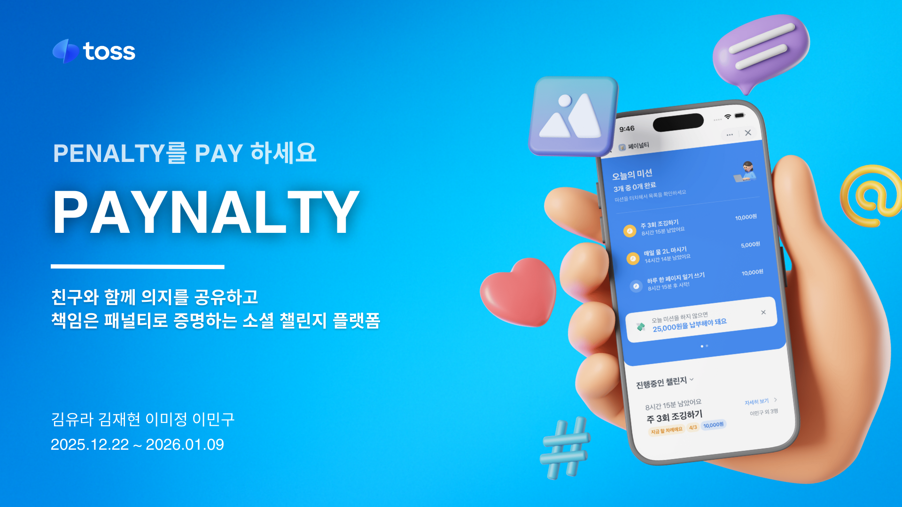

---

### 📱 UI Preview

|                                  메인 화면                                   |                             오늘의 미션                              |
|:------------------------------------------------------------------------:|:---------------------------------------------------------------:|
| 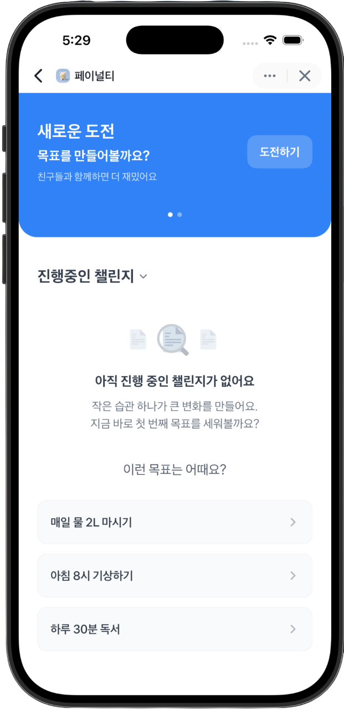 | 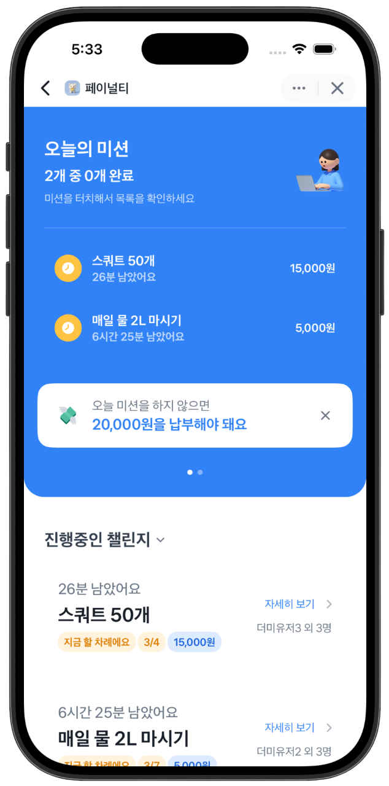 |

---

### 🛠 Tech Stack

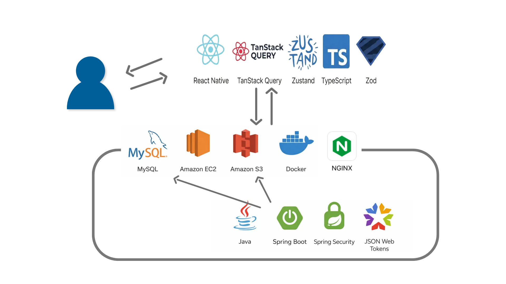

---

### 🚀 Workflow

### FRONT

#### 상태 관리 전략

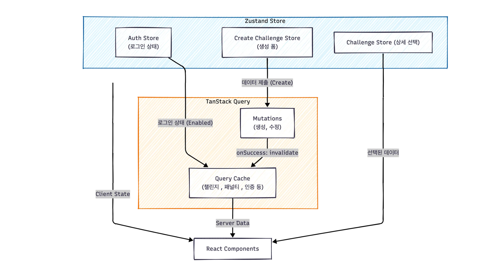

#### 인증 및 데이터 동기화 / 챌린지 삭제

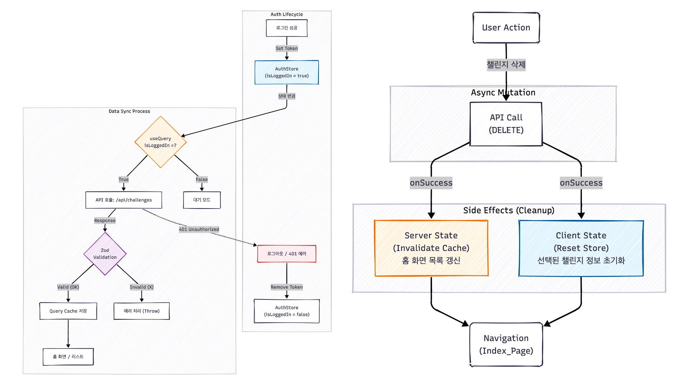

### BACKEND

#### 토스 로그인

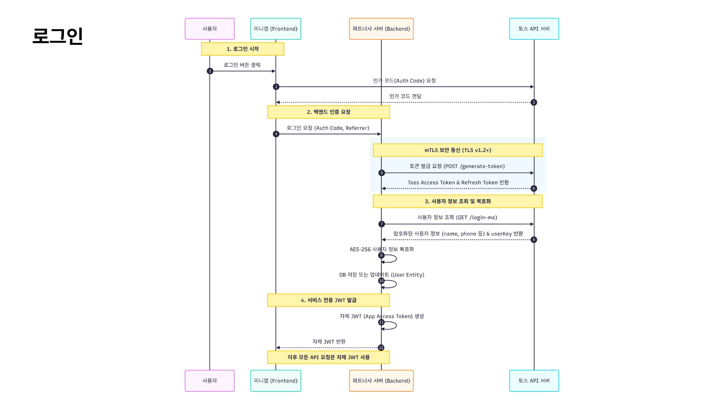

#### 챌린지 생성

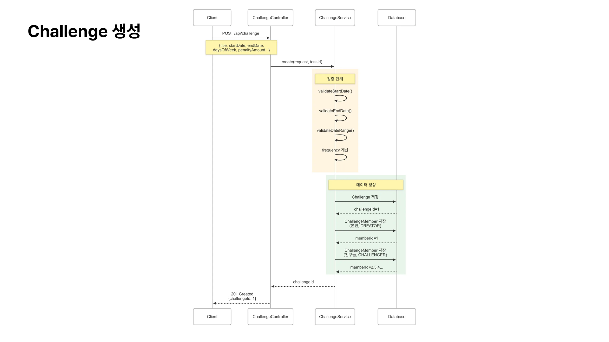

#### 인증 생성

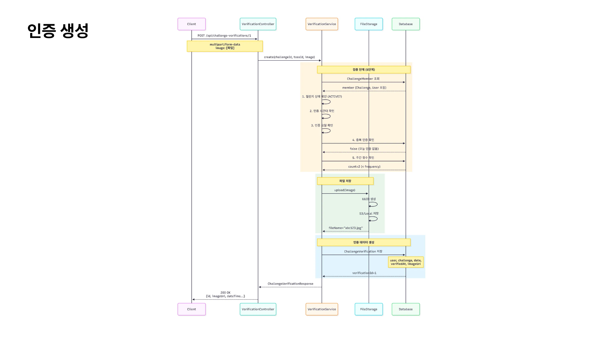

#### window generator

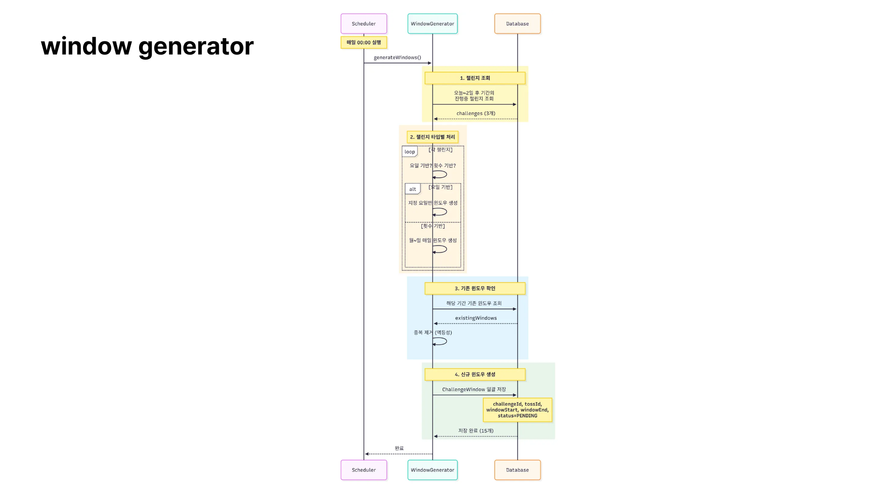

#### window enforcer

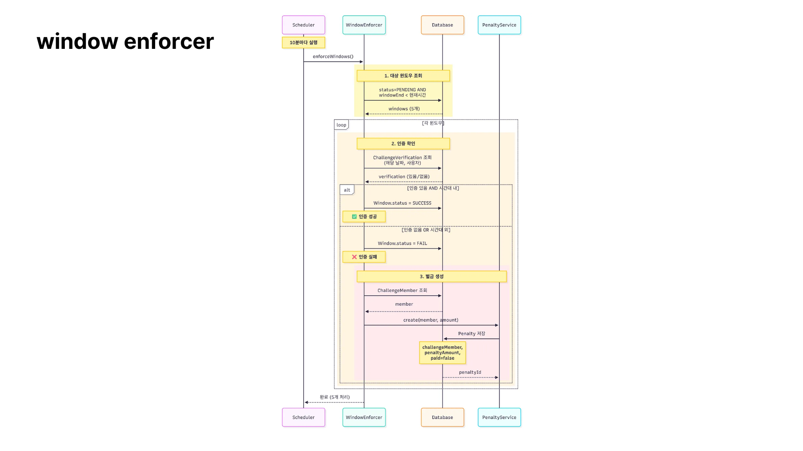
---

### 시연 영상

|**온보딩, 메인, 로그인**|**챌린지 생성**|
|:----------------------------------------:|:-----------------------------------------------:|
|  |  |
|**친구 초대**|**챌린지 디테일/벌금, 인증 내역, 수정 삭제**|
|||
|**인증 하기**||
|||

---

### 💻 Getting Started

#### Prerequisites

- **JDK 21**
- AppsInToss Console에서 발급받은 **mTLS 인증서 (.pem)**
- 환경변수 파일 .env
- 샌드박스 APP

#### Frontend Setup

```bash
cd front
npm install
npm run dev
```

---